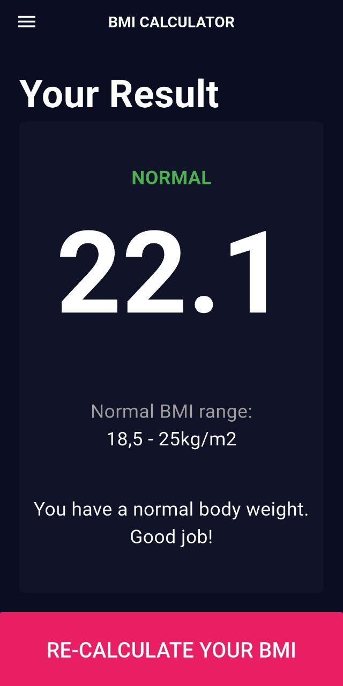
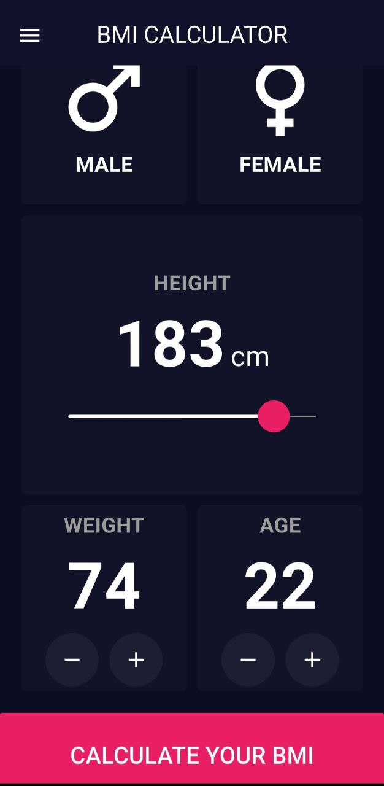

# ✔️ BMI Calculator App

<div align="start">
  <a href="https://api.visitorbadge.io/api/visitors?path=DailyDone-App&label=People%20who%20visited%20this%20page&countColor=%23263759" target="_blank">
    
  </a>
  <a href="https://www.linkedin.com/in/ahmad-alhomsy963" target="_blank">
    
  </a>
  <a href="mailto:ahmadhoahmadho@gmail.com">
    
  </a>
</div>

---

## 🧮 BMI Calculator (Flutter)

A simple Flutter app that calculates the Body Mass Index (BMI) based on user input.
Designed as a beginner-friendly project to practice UI, navigation, and basic logic in Flutter.

---

## 📱 Screenshots

| | |
|:-:|:-:|
|  |  |

---

## ⚙️ Installation

1. **Clone the repository**
   ```bash
   git clone https://github.com/ahmadhomsy/bmi_calculator.git
   ```

2. **Install dependencies**
   ```bash
   flutter pub get
   ```

3. **Run the app**
   ```bash
   flutter run
   ```
   
---

## 💜 Contributing

Contributions are welcome!  
Feel free to **open an issue** or **submit a pull request** to suggest improvements.

---

## 👨🏻‍💻 Developer

> Developed by **Ahmad Homsy**  
> 📫 Reach me at: [ahmadhoahmadho@gmail.com](mailto:ahmadhoahmadho@gmail.com)  
> 💼 LinkedIn: [ahmadhomsy](https://www.linkedin.com/in/ahmad-alhomsy963)  
